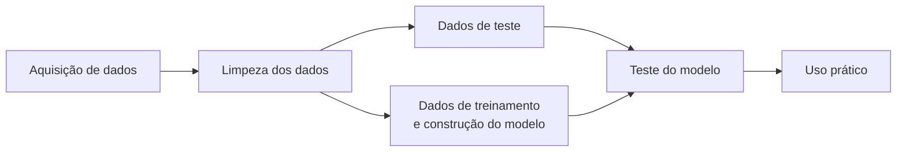

<h2 align="center">Estudos de Ciência de Dados</h2>

  <em>Material pessoal de estudos, construído com dedicação e agora compartilhado com a comunidade.</em> 
  <strong>Rafael Alves Tegazzini,</strong> 10 de Agosto de 2025

# Sumário

- [Sumário](#sumário)
- [Introdução](#introdução)
- [Python](#python)
  - [Bibliotecas](#bibliotecas)
    - [NumPy](#numpy)
  - [Algoritmos](#algoritmos)
    - [Introdução Machine Learning](#introdução-machine-learning)
    - [O Fluxo](#o-fluxo)
    - [Casos de uso](#casos-de-uso)
      - [Curto Prazo](#curto-prazo)
      - [Longo Prazo](#longo-prazo)
    - [Tipos de algoritmos](#tipos-de-algoritmos)
      - [Aprendizado supervisionado](#aprendizado-supervisionado)
        - [Regressão Linear](#regressão-linear)
      - [Aprendizado não supervisionado](#aprendizado-não-supervisionado)
      - [Aprendizado por reforço](#aprendizado-por-reforço)
  

---

# Introdução

Ciência de Dados é uma área interdisciplinar que utiliza métodos científicos, processos, algoritmos e sistemas para extrair conhecimento e insights de dados estruturados e não estruturados. Este documento será preenchido com meus estudos, o objetivo é me tornar um cientista de dados experiente e referência técnica. Criei este documento como uma forma de organizar tudo o que venho aprendendo, conceitos, anotações, códigos e experimentos.  

---
# Python

## Bibliotecas

### NumPy
*Conteúdo prático em `app\numpy\libNumpy.ipynb`*
  * Numerical Python
    1. Focada em computação numérica de alta performance, é a base de praticamente todo ecossistema de Ciência de Dados, Machine Learning e estatística no Python. Escrita em C e Fortran por baixo dos panos, fazendo cálculos 100x mais rápidos que listas Python para operações numéricas.
    2. Ferramentas matemáticas avançadas;
       1. Álgebra linear (`np.linalg`)
       2. Estatística (`np.mean`, `np.std`)
       3. Geração de números aleatórios (`np.random`)
    3. Interação com outras bibliotecas
       1. Pandas
       2. Scikit-Learn
       3. TensorFlow
       4. PyTorch
       5. OpenCV e muitas outras.

---

## Algoritmos

### Introdução Machine Learning
> Machine Learning é um método de análise de dados que automatiza o processo de criação de modelos, usando algoritmos que aprendem com dados, permitindo que omputadores encontem padrões escondidos nos dados sem terem sido programados para isso. Em vez de escrever regras manuais para resolver um problema, em ML você fornece dados e o modelo aprende como resolver o problema com base nesses dados.

### O Fluxo

### Casos de uso
#### Curto Prazo
  1. Classificação de e-mails como spam
  2. Previsão de vendas
  3. Análise de churn de clientes (quem vai cancelar)
  4. Detecção de anomalias em transações financeiras
  5. Recomendações de produtos
#### Longo Prazo
  1. Veículos autônomos
  2. Diagnóstico médico automatizado com imagens ou exames
  3. Cérebro-Máquina
  4. Cidades Autônomas
  5. Modelos de Consciência Artificial Generalizada ☠

### Tipos de algoritmos
#### Aprendizado supervisionado
O algoritmo recebe entradas com as saídas corretas e ajusta o seu modelo de forma iterativa para que o mesmo se adapte as condições apresentadas no conjunto de dados de treino. Posteriormente, o algoritmo irá conferir a precisão do modelo criado usando o conjunto de dados de teste.

  1. Dados de treino: você fornece uma base de dados com:
     1. Informações de entrada `features` \(X\) (exemplo, idade, salário, investimentos, etc.)
     2. A saída `target` correta, que você já sabe \(y\) (exemplo, se a pessoa contratou ou não um produto bancário)
  2. Aprendizado: o modelo tenta encontrar algum padrão de \(X\) que consiga prever \(y\).
  3. Predição: depois de treinado, o modelo pode prever os targets \(y\) de novos dados \(X\) que nunca viu antes.

##### Regressão Linear
*Conteúdo prático em `app\algoritmos\supervisionado\algoritmoRegressaoLinear.ipynb`*
"A arte, como a moral, consiste em determinar limites."[^1]
[^1] G. K. Chesterton

#### Aprendizado não supervisionado

#### Aprendizado por reforço
   

---