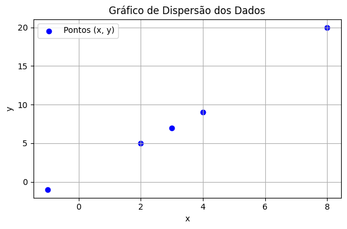

<h2 align="center">Estudos de Ciência de Dados</h2>

  <em>Material pessoal de estudos, construído com dedicação e agora compartilhado com a comunidade.</em> 
  <strong>Rafael Alves Tegazzini,</strong> 10 de Agosto de 2025

# Sumário

- [Sumário](#sumário)
- [Introdução](#introdução)
- [Python](#python)
  - [Bibliotecas](#bibliotecas)
    - [NumPy](#numpy)
  - [Algoritmos](#algoritmos)
    - [Introdução Machine Learning](#introdução-machine-learning)
    - [O Fluxo](#o-fluxo)
    - [Casos de uso](#casos-de-uso)
      - [Curto Prazo](#curto-prazo)
      - [Longo Prazo](#longo-prazo)
    - [Tipos de algoritmos](#tipos-de-algoritmos)
      - [Aprendizado supervisionado](#aprendizado-supervisionado)
        - [Regressão Linear](#regressão-linear)
        - [1. Tabela Estendida](#1-tabela-estendida)
        - [2. Cálculo do Coeficiente Angular ( B )](#2-cálculo-do-coeficiente-angular--b-)
        - [3. Cálculo do Intercepto ( A )](#3-cálculo-do-intercepto--a-)
        - [4. Equação da Reta de Regressão](#4-equação-da-reta-de-regressão)
        - [5. Cálculo do Coeficiente de Correlação de Pearson ( r\_{xy} )](#5-cálculo-do-coeficiente-de-correlação-de-pearson--r_xy-)
        - [Conclusão](#conclusão)
      - [Aprendizado não supervisionado](#aprendizado-não-supervisionado)
      - [Aprendizado por reforço](#aprendizado-por-reforço)
  

---

# Introdução

Ciência de Dados é uma área interdisciplinar que utiliza métodos científicos, processos, algoritmos e sistemas para extrair conhecimento e insights de dados estruturados e não estruturados. Este documento será preenchido com meus estudos, o objetivo é me tornar um cientista de dados experiente e referência técnica. Criei este documento como uma forma de organizar tudo o que venho aprendendo, conceitos, anotações, códigos e experimentos.  

---
# Python

## Bibliotecas

### NumPy
*Conteúdo prático em `app\numpy\libNumpy.ipynb`*
  * Numerical Python
    1. Focada em computação numérica de alta performance, é a base de praticamente todo ecossistema de Ciência de Dados, Machine Learning e estatística no Python. Escrita em C e Fortran por baixo dos panos, fazendo cálculos 100x mais rápidos que listas Python para operações numéricas.
    2. Ferramentas matemáticas avançadas;
       1. Álgebra linear (`np.linalg`)
       2. Estatística (`np.mean`, `np.std`)
       3. Geração de números aleatórios (`np.random`)
    3. Interação com outras bibliotecas
       1. Pandas
       2. Scikit-Learn
       3. TensorFlow
       4. PyTorch
       5. OpenCV e muitas outras.

---

## Algoritmos

### Introdução Machine Learning
> Machine Learning é um método de análise de dados que automatiza o processo de criação de modelos, usando algoritmos que aprendem com dados, permitindo que omputadores encontem padrões escondidos nos dados sem terem sido programados para isso. Em vez de escrever regras manuais para resolver um problema, em ML você fornece dados e o modelo aprende como resolver o problema com base nesses dados.

### O Fluxo

### Casos de uso
#### Curto Prazo
  1. Classificação de e-mails como spam
  2. Previsão de vendas
  3. Análise de churn de clientes (quem vai cancelar)
  4. Detecção de anomalias em transações financeiras
  5. Recomendações de produtos
#### Longo Prazo
  1. Veículos autônomos
  2. Diagnóstico médico automatizado com imagens ou exames
  3. Cérebro-Máquina
  4. Cidades Autônomas
  5. Modelos de Consciência Artificial Generalizada ☠

### Tipos de algoritmos
#### Aprendizado supervisionado
O algoritmo recebe entradas com as saídas corretas e ajusta o seu modelo de forma iterativa para que o mesmo se adapte as condições apresentadas no conjunto de dados de treino. Posteriormente, o algoritmo irá conferir a precisão do modelo criado usando o conjunto de dados de teste.

  1. Dados de treino: você fornece uma base de dados com:
     1. Informações de entrada `features` \(X\) (exemplo, idade, salário, investimentos, etc.)
     2. A saída `target` correta, que você já sabe \(y\) (exemplo, se a pessoa contratou ou não um produto bancário)
  2. Aprendizado: o modelo tenta encontrar algum padrão de \(X\) que consiga prever \(y\).
  3. Predição: depois de treinado, o modelo pode prever os targets \(y\) de novos dados \(X\) que nunca viu antes.

##### Regressão Linear
*Conteúdo prático em `app\algoritmos\supervisionado\algoritmoRegressaoLinear.ipynb`*
"A arte, como a moral, consiste em determinar limites."[^1]
[^1]: G. K. Chesterton

Regressão linear é uma técnica estatística usada para modelar a relação entre uma variável `target` e uma ou mais variáveis `features`. O objetivo principal é prever ou estimar o valor da variável `target` com base nos valores das variáveis `features`. O que buscamos ao aplicar a regressão linear é ajustar uma linha reta que melhor represente a tendência dos dados, ou seja, que passe o mais próximo possível dos pontos observados. Esse processo envolve minimizar a soma das distâncias verticais (erros) entre os pontos reais e a linha ajustada — um método conhecido como mínimos quadrados.

* Podendo ser utilizada em diversos casos
  1. Imobiliário
     1. Previsão de preços de imóveis com base em características como tamanho, localização, número de quartos, idade do imóvel, etc.
  2. Finanças
     1. Projeção de lucros ou receitas futuras com base em dados históricos.
     2. Modelagem do retorno de ações com base em indicadores econômicos ou financeiros.
     3. Análise de risco de crédito considerando renda, idade, histórico de dívidas, etc.
  3. Saúde
     1. Previsão do tempo de recuperação de pacientes com base em idade, tipo de cirurgia, condição clínica.
     2. Relação entre pressão arterial e idade, peso ou nível de atividade física.

---

* Fórmulas

  *Equação da reta*, primeiro \(B\) é calculado, pois, \(A\) precisa de \(B\).
$$
y = A + Bx
$$

  *Coeficiente Angular (B):*
$$
B = \frac{n \sum x_i y_i - \sum x_i \sum y_i}{n \sum x_i^2 - \left( \sum x_i \right)^2}
$$

  *Intercepto (A):*
$$
A = \frac{\sum y - B \sum x}{n}
$$

*Coeficiente de correlação de Pearson:*
$$
r_{xy} = \frac{n \sum x_i y_i - \sum x_i \sum y_i}{\sqrt{n \sum x_i^2 - \left( \sum x_i \right)^2} \cdot \sqrt{n \sum y_i^2 - \left( \sum y_i \right)^2}}
$$

* Exemplo prático
Tendo a seguinte tabela:

<!-- Imagem à esquerda -->

  

<!-- Tabela à direita -->

| x  | y  |
|----|----|
| 3  | 7  |
| 2  | 5  |
| -1 | -1 |
| 4  | 9  |

##### 1. Tabela Estendida

Para calcular manualmente os coeficientes da regressão linear, construímos uma tabela estendida com as colunas \( x^2 \), \( y^2 \) e \( xy \). Essa tabela fornece os valores necessários para aplicar as fórmulas da reta de regressão:

\[
y = A + Bx
\]

> Precisamos dos seguintes somatórios: \( \sum x \), \( \sum y \), \( \sum x^2 \), \( \sum y^2 \), \( \sum xy \), além da quantidade de dados \( n \).

| x  | y  | \(x^2\) | \(y^2\) | \(xy\) |
|----|----|--------|--------|--------|
| 3  | 7  | 9      | 49     | 21     |
| 2  | 5  | 4      | 25     | 10     |
| -1 | -1 | 1      | 1      | 1      |
| 4  | 9  | 16     | 81     | 36     |
| **Soma** | **8** | **20** | **30** | **156** | **68** |

Total de pontos: \( n = 4 \)

---

##### 2. Cálculo do Coeficiente Angular \( B \)

\[
B = \frac{n \sum xy - \sum x \sum y}{n \sum x^2 - (\sum x)^2}
\]

Substituindo os valores:

\[
B = \frac{4 \cdot 68 - 8 \cdot 20}{4 \cdot 30 - 8^2} = \frac{272 - 160}{120 - 64} = \frac{112}{56}
\]

\[
\boxed{B = 2}
\]

---

##### 3. Cálculo do Intercepto \( A \)

\[
A = \frac{\sum y - B \sum x}{n}
\]

\[
A = \frac{20 - 2 \cdot 8}{4} = \frac{20 - 16}{4} = \frac{4}{4}
\]

\[
\boxed{A = 1}
\]

---

##### 4. Equação da Reta de Regressão

Com \( A = 1 \) e \( B = 2 \), temos:

\[
\boxed{y = 1 + 2x}
\]

---

##### 5. Cálculo do Coeficiente de Correlação de Pearson \( r_{xy} \)

A fórmula de Pearson mede a intensidade da relação linear entre \( x \) e \( y \):

\[
r_{xy} = \frac{n \sum xy - \sum x \sum y}
{\sqrt{n \sum x^2 - (\sum x)^2} \cdot \sqrt{n \sum y^2 - (\sum y)^2}}
\]

\[
r_{xy} = \frac{4 \cdot 68 - 8 \cdot 20}
{\sqrt{4 \cdot 30 - 8^2} \cdot \sqrt{4 \cdot 156 - 20^2}}
\]

\[
r_{xy} = \frac{272 - 160}
{\sqrt{120 - 64} \cdot \sqrt{624 - 400}} = \frac{112}{\sqrt{56} \cdot \sqrt{224}}
\]

\[
\boxed{r_{xy} = 1}
\]

---

##### Conclusão

- A equação da reta é: \( y = 1 + 2x \)
- O coeficiente de correlação \( r = 1 \) indica **correlação linear perfeita positiva**, os pontos estão exatamente sobre a reta ajustada.

 

#### Aprendizado não supervisionado

#### Aprendizado por reforço
   

---